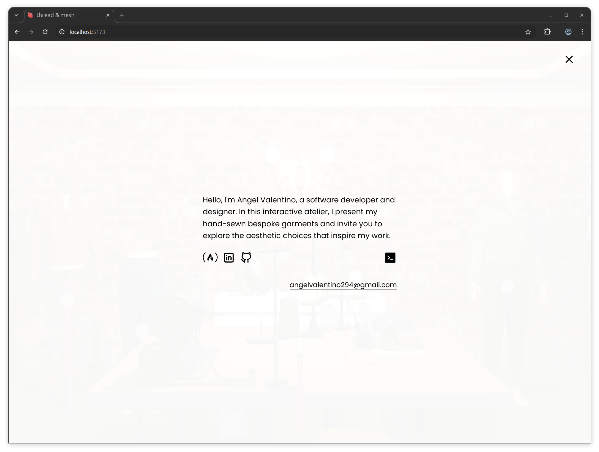

# thread & mesh – A Digital Atelier for Bespoke Garments


## 📋 About

[thread & mesh](https://taskflowapp.net/) is an interactive web-based atelier built with Three.js where I present my hand sewn bespoke garments inside a navigable 3D environment. Built with WebGL and vanilla JavaScript, the experience is smooth, responsive, and designed to feel purposeful rather than decorative. 

> Its primary goal is to convey the concept at first glance, showcasing my sewing, aesthetic, and engineering skills. Inspired by the hypothalamus’ exploratory system, it sparks curiosity and creates a memorable experience —what matters is not what the user sees, but what they feel.

Accessibility is treated as a first-class concern. Despite being a 3D experience, thread & mesh is fully keyboard navigable with consistent focus management throughout. Semantic HTML and ARIA practices are applied across all UI layers, including complex modal based interfaces. 

A key part of this is my custom [vanilla-aria-modal npm package](https://www.npmjs.com/package/vanilla-aria-modals), which handles modal stacking, focus trapping, escape behavior and keyboard navigation throughout the application. My idea is that no matter how experimental the medium may be, the journey should remain the same for everyone.

### 🪡 Concept and Intent

thread & mesh sits at the intersection of fashion, design, and software engineering, communicating through experience rather than text. By moving through the site and interacting with garments, visitors form an understanding naturally. The project draws attention through exploration rather than instruction.

The project is intentionally quiet and focused. There is no spectacle for its own sake. Every interaction prioritizes clarity and presence, mirroring the physical process of garment making where attention and material understanding matter more than speed or excess.

### 🌟 Acknowledgements

This project draws inspiration from several sources that shaped its development:

- I drew initial guidance from Bruno Simon’s Three.js tutorials and Grant Gabbit’s Blender modeling guides, which provided a starting point for learning the basics. The project itself was developed independently, building my own workflow and approach to 3D design.  

**Blender Render**  
A render of the main scene created in Blender using the Cycles engine. 


**Reference Image**  
The concept image that guided the design direction. The reference is from Modernize Tailors, Vancouver.  


<br>

## 🚀 Features

- 🎥 **UI/UX and Camera Management:** Smooth camera control and intuitive user interaction throughout the scenes.  
- 🎨 **GSAP Animations:** Used selectively for smooth, controlled transitions and UI animations.  
- 🧠 **Engagement-Driven Exploration:** Designed to draw user attention naturally, encouraging exploration leading to a memorable experience.
- 📱 **Responsive Interface:** Fully responsive design that adapts seamlessly to desktops, tablets, mobiles, and smaller screens. 
- 🌍 **Accessibility Focus:** Built with inclusivity in mind, emphasizing keyboard navigation, semantic HTML, and ARIA support to ensure the experience works for everyone.  
- ⚡ **Optimized Performance:** Built with Vite for fast development and optimized production builds, with all 3D models created in Blender, exported as GLTF, and compressed with Draco for smooth runtime performance on both older and modern devices, including proper loading UI and feedback for users. 
- 🗂️ **vanilla-aria-modals Implementation:** The [modal handler](https://www.npmjs.com/package/vanilla-aria-modals) utility ensures consistent ARIA behavior, keyboard navigation, modal stacking, and focus management across menus and scenes. 
- 🏗️ **Object-Oriented Architecture:** Modular, object-oriented design separates the core system, garment logic, UI and experience layers. Ensuring maintainability and scalability.
- 🧩 **Reusable Components:** Core logic, UI panels, and interaction modules are designed to be reusable across the application.  

### 📊 Audit and Security Scores

Below are the actual audit and security test results demonstrating the app’s performance and integrity. [-> Read more about performance and limitations.](#-evolution-features-and-limitations)


<br>

## 🧪 Local Development

### Clone the repository

```bash
git clone https://github.com/angelvalentino/thread-and-mesh.git
```

- Run the following command to install the necessary dependencies

  ```bash
  npm install
  ```

### Development and Production

- For development with vite:
  
  ```bash
  npm run dev
  ```

- To create the final production build, run:
  
  ```bash
  npm run build
  ```

- To see the final build:
  
  ```bash
  npm run preview
  ```

<br>

## 📁 Further Documentation

[Walkthrough Video]() – Short summary with visuals

<br>

## 🌱 Evolution, Features and Limitations

While carefully polished, it remains a real time 3D environment, which introduces inherent limitations around accessibility, ARIA support, and performance despite best practices being applied. Optimized for desktop, with mobile support available but best experienced by tilting the device due to the panoramic nature of the scenes. Creating a separate mobile specific experience would undermine the goal of a single, unified atelier. 

To optimize mobile performance, certain elements such as the wall lamp lighting were removed to maintain a smooth framerate of 30+ FPS on most devices. On smaller screens, these changes are barely noticeable, and the experience remains visually consistent. 

<br>

## 🖼️ Additional Images




<br>

## 📬 Contact

Feel free to reach out for feedback, collaboration, or opportunities:

- **GitHub**: [angelvalentino](https://github.com/angelvalentino)  
- **Email**: angelvalentino294@gmail.com

While I deeply value collaboration and community feedback, this project serves as a personal showcase of my software development and engineering skills. For that reason, I personally implement all features and improvements.

That said, I welcome **issues**, **suggestions**, and **feedback** considering **pull requests for bugs or non-feature enhancements** on a case-by-case basis.

If the project evolves into a team-led initiative or a paid service in the future, collaboration may become a more active part of its development. Until then, thank you for your support and interest!